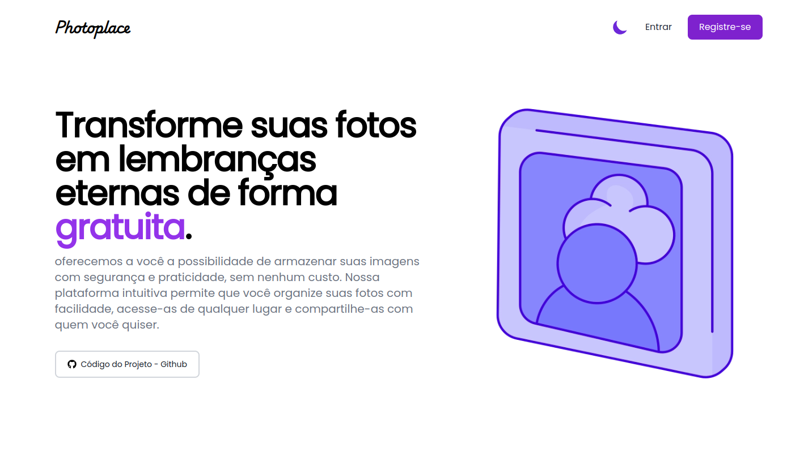
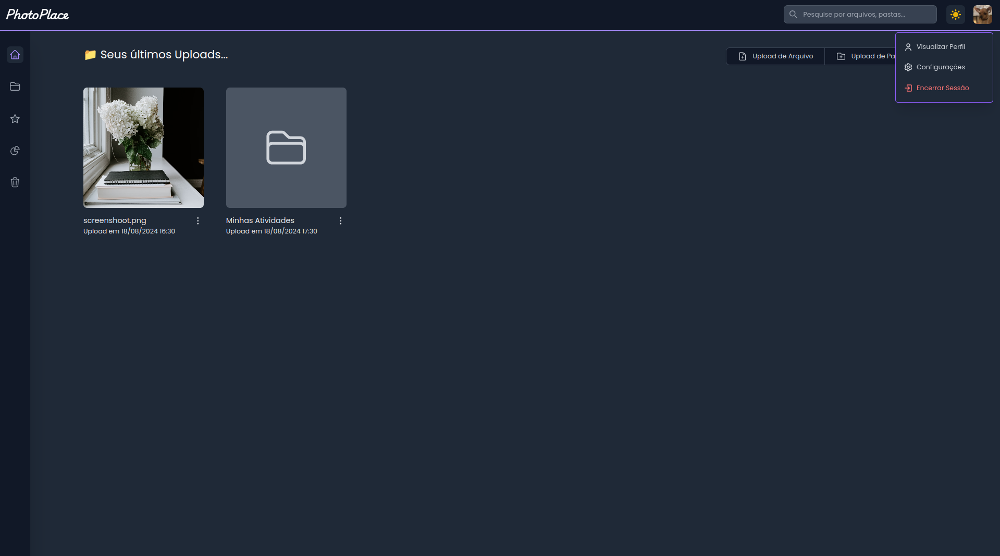

# Photoplace


<div>
    
    <!--  -->
</div>

Photoplace é uma aplicação web desenvolvida com NuxtJS 3, projetada para oferecer uma experiência incrível para explorar e compartilhar fotos.

## Tecnologia Utilizada

- **[NuxtJS 3](https://nuxt.com/)**: Framework para [Vue.js](https://vuejs.org/)

## Rodando o Projeto

### Pré-requisitos

Certifique-se de ter o Node.js e o npm (ou Yarn) instalados em sua máquina. Você pode verificar isso com:

```bash
$ node -v
$ npm -v
```

### Instalando Dependências

Clone o repositório e instale as dependências:

```bash
$ git clone https://github.com/iamThiagoo/photoplace.git
$ cd photoplace
$ npm install
```

### Servidor de Desenvolvimento

Para iniciar o servidor de desenvolvimento e ver o aplicativo em `http://localhost:3001`, execute:

```bash
$ npm run dev
```

### Construção para Produção

Para criar uma versão otimizada da aplicação para produção, execute:

```bash
$ npm run build
```

Depois, você pode iniciar o servidor de produção com:

```bash
$ npm run start
```

## Documentação da API

O projeto depende de uma serviço externo para a autenticação e fornecimento dos dados. O serviço criado é o **[Photoplace API](https://github.com/iamThiagoo/photoplace-api)**, construído em **[NestJS](https://nestjs.com/)**. Certifique-se de configurar e iniciar este serviço para que o aplicativo funcione corretamente.

## Licença

Este projeto está licenciado sob a [MIT License](LICENSE).
